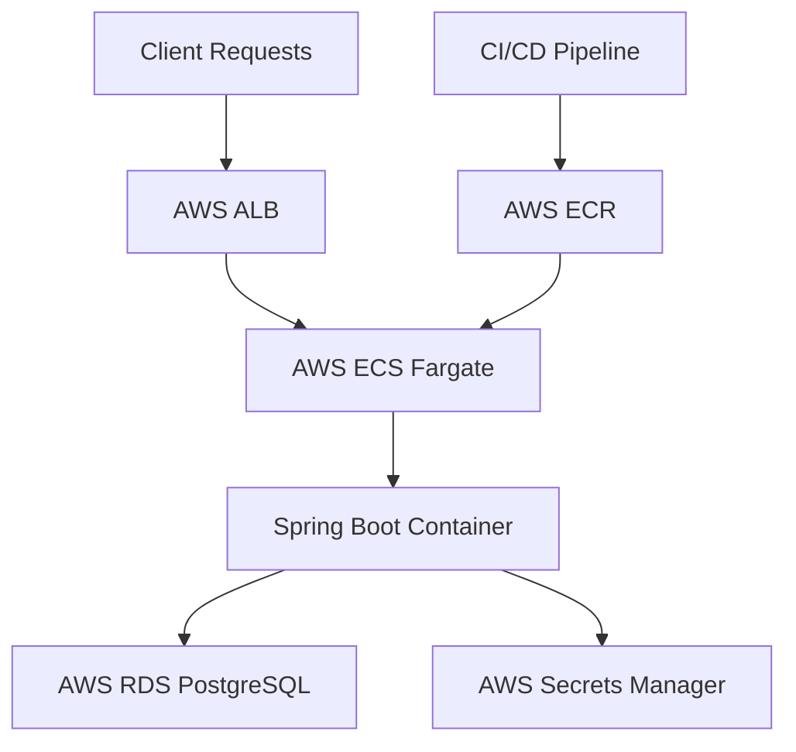

# 🚀 Stock Management System API

## 📞 Contact

**Developer:** Gustavo Maia - Full Stack Developer | Front-End | Back-End
**Email:** gustavodiniz37@hotmail.com
**Portfolio:** https://portfolio-gusdinizmaia.vercel.app 
**Linkedin**: https://www.linkedin.com/in/gustavodinizm/
**Project Link:** https://github.com/gusdinizmaia2/management_system

## 🌟 Overview

A comprehensive and scalable **Stock Management System API** built with Spring Boot, featuring advanced inventory control, supplier management, transaction tracking, and analytical reporting. This production-ready solution demonstrates modern backend architecture with enterprise-grade security and cloud deployment.

## ✨ Key Features

- **🔐 Secure Authentication** - JWT-based authentication with role-based authorization
- **📊 Advanced Inventory Management** - Complete CRUD operations with complex business rules
- **🤝 Supplier Integration** - Manage vendor relationships and procurement processes
- **📈 Analytical Reporting** - Business intelligence with complex queries and data aggregation
- **🔒 Enterprise Security** - Protected endpoints with proper access control
- **🐳 Containerized Deployment** - Fully dockerized with cloud-native architecture
- **☁️ AWS Cloud Hosted** - Production deployment on AWS infrastructure

## 🏗️ Architecture & Design

The project follows clean architecture principles with clear separation of concerns:

```
src/
├── config/          # Global configurations (Security, CORS, Beans)
├── controller/      # REST API endpoints
├── dto/             # Data Transfer Objects (Request/Response)
├── exception/       # Custom exception handling
├── model/           # JPA entities and domain models
├── repository/      # Data access layer (Spring Data JPA)
├── service/         # Business logic layer
└── util/            # Utilities and helpers
```

## 🛠️ Technology Stack

### Backend Framework
- **Java 17** - Modern Java features and performance
- **Spring Boot 3.2.0** - Rapid application development
- **Spring Security** - Robust authentication and authorization
- **Spring Data JPA** - Efficient database operations
- **JWT (jjwt)** - Stateless token-based authentication

### Database
- **PostgreSQL** - Relational database for transactional data

### Infrastructure & DevOps
- **Docker** - Containerization for consistent environments
- **AWS ECR** - Container registry for Docker images
- **AWS ECS with Fargate** - Serverless container orchestration
- **AWS RDS** - Managed PostgreSQL database
- **AWS ALB** - Application load balancing

### Development Tools
- **Maven** - Dependency management and build automation
- **SpringDoc OpenAPI** - API documentation

## 📋 Core Functionalities

### 🔐 Authentication & Authorization
- User registration and login with JWT tokens
- Role-based access control (Admin, Manager, User)
- Token refresh mechanism
- Secure password hashing with BCrypt

### 📦 Product Management
- Complete CRUD operations for products
- Stock level tracking with alerts
- Product categorization and filtering
- Batch operations for bulk updates

### 🏢 Supplier Management
- Supplier information management
- Purchase order tracking
- Performance metrics and ratings
- Contact and contract management

### 📊 Transaction System
- Stock movements (in/out/transfer)
- Transaction history with audit trail
- Real-time inventory updates
- Multi-warehouse support

### 📈 Reporting & Analytics
- Inventory valuation reports
- Movement history analysis
- Supplier performance dashboards
- Custom query endpoints for business intelligence

## 🚀 Deployment Architecture



### AWS Services Utilized:
- **Amazon ECS with Fargate** - Serverless compute for containers
- **Amazon ECR** - Secure container registry
- **Amazon RDS** - Managed PostgreSQL database
- **Application Load Balancer** - Traffic distribution and SSL termination
- **AWS Secrets Manager** - Secure credential storage
- **Amazon CloudWatch** - Monitoring and logging

## 🔧 Getting Started

### Prerequisites
- Java 17 or higher
- Maven 3.6+
- Docker 20.10+
- PostgreSQL 14+

### Local Development

1. **Clone the repository**
   ```bash
   git clone https://github.com/yourusername/stock-management-api.git
   cd stock-management-api
   ```

2. **Configure environment variables**
   ```bash
   cp .env.example .env
   # Edit .env with your configuration
   ```

3. **Build and run with Docker**
   ```bash
   docker-compose up --build
   ```

4. **Or run locally**
   ```bash
   mvn clean install
   mvn spring-boot:run
   ```

### API Access
```
# Base URL (Development)
http://localhost:8080

# Production URL
[INSERT PRODUCTION URL HERE]

# API Documentation
[INSERT SWAGGER/OPENAPI DOCUMENTATION LINK HERE]
```

## 📚 API Documentation

Comprehensive API documentation is available through:

- **Interactive Swagger UI**: `[INSERT SWAGGER UI LINK HERE]`
- **Postman Collection**: Available in `/docs` directory
  

## 🐳 Docker Deployment

### Build Docker Image
```bash
docker build -t stock-management-api .
```

### Run Container
```bash
docker run -p 8080:8080 \
  -e SPRING_DATASOURCE_URL=jdbc:postgresql://host.docker.internal:5432/stockdb \
  -e SPRING_DATASOURCE_USERNAME=admin \
  -e SPRING_DATASOURCE_PASSWORD=secret \
  stock-management-api
```

### Push to AWS ECR
```bash
aws ecr get-login-password --region region | docker login --username AWS --password-stdin aws_account_id.dkr.ecr.region.amazonaws.com
docker tag stock-management-api:latest aws_account_id.dkr.ecr.region.amazonaws.com/stock-management-api:latest
docker push aws_account_id.dkr.ecr.region.amazonaws.com/stock-management-api:latest
```

## 🔐 Security Features

- **JWT Authentication** - Secure stateless sessions
- **Password Encryption** - BCrypt hashing
- **SQL Injection Protection** - Parameterized queries
- **CORS Configuration** - Controlled cross-origin access
- **Input Validation** - Comprehensive DTO validation
- **Rate Limiting** - Protection against brute force attacks

## 📊 Database Schema

The system uses a normalized database schema with:
- **Users & Roles** - Authentication and authorization
- **Products** - Inventory items with categories
- **Suppliers** - Vendor information
- **Transactions** - Stock movement history
- **Warehouses** - Storage locations
- **Reports** - Analytical data aggregates

## 🤝 Contributing

1. Fork the repository
2. Create your feature branch (`git checkout -b feature/amazing-feature`)
3. Commit your changes (`git commit -m 'Add some amazing feature'`)
4. Push to the branch (`git push origin feature/amazing-feature`)
5. Open a Pull Request

---

<div align="center">
  
### ⭐️ Don't forget to star this repository if you find it useful!

</div>

---

*This project was developed as a demonstration of advanced Spring Boot capabilities, cloud-native architecture, and enterprise-grade API design.*
